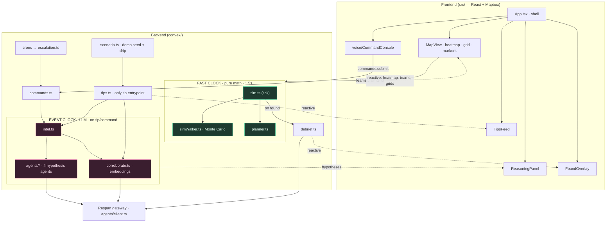

# LOCUS

Voice-driven search-and-rescue command center. LLM agents reason about who
the missing person is, a Monte Carlo simulation computes where they likely
are and how to search fastest, and the coordinator drives it all hands-free
by voice. The probability picture re-plans itself as new information arrives.

Built for the Voice Coding Hackathon (Convex SF). Sponsors woven in:
**Convex** runs the entire live world, **Respan** gateways every LLM call,
**Voice Cursor** is how we command it (and how we built it).

Grounded in Robert Koester's ISRID lost-person-behavior research and the
Hashimoto et al. (Nature Sci Reports 2022) agent-based lost-person model.
This is decision support for trained searchers, not an autonomous finder.

## Architecture

**Invariant: the LLM reasons, math does the searching, voice drives it.** LOCUS
runs one active case over a square lat/lng grid, driven by two independent clocks:

- **Fast clock** (`convex/sim.ts`, self-scheduling every 1.5s) — **pure math, zero LLM.**
  Ages tips, runs a seeded Monte-Carlo walker (`simWalker.ts`), suppresses searched
  cells, normalizes a probability heatmap, moves teams, checks for the hidden subject,
  and greedily assigns teams to high-probability cells (`planner.ts`).
- **Event clock** (`convex/intel.ts`, fires only on new tips/commands, debounced 10s) —
  **all LLM reasoning.** Parses voice/console commands into typed intents, judges tip
  credibility, and re-weights four Koester lost-person hypotheses (hiker/dementia/child/
  injured), each an `@convex-dev/agent` with persistent thread memory.

The React frontend is a single map-centric screen — a full-bleed Mapbox `MapView` with
glassmorphism panels on top, fed entirely by push-based Convex subscriptions (never polls).
The only two human inputs are **map clicks** (claim a grid cell for a team) and the
**CommandConsole** (voice/typed commands).



### Data model (`convex/schema.ts` — FROZEN)

Root table is `cases`; everything references it via `caseId`. Grid convention: cell
`(0,0)` = SW corner, heatmap indexed `[y][x]`, all cell↔lat/lng math goes through
`convex/lib/geo.ts` (never inlined; the frontend imports the same file).

| Table | Purpose | Notable fields |
|---|---|---|
| `cases` | the one active search | grid bounds + `gridSize`, `lastKnownLat/Lng`, `terrainCells`, `landmarks`, `hiddenTrueLat/Lng` (**never render before `status==="found"`**), `status`, `debrief?` |
| `simState` | tick loop's read-modify-write row | `tick`, `running`, `simClockMin`, `heatmap:number[y][x]` (max=1), `foundAtTick?`, `lastReasonedAt?` (debounce) |
| `hypotheses` | one Koester profile per case | `profile`, `weight` (∑≈1, floored 0.02), `reasoning`, `threadId?`, `behaviorWeights`, `terrainAffinity` |
| `tips` | sightings | `text`, `lat/lng`, `credibility` (LLM-judged), `weight` (half-life aged), `embedding?` (1536-d vector index), `corroborates?` |
| `grids` | per-cell search/claim | `searched`, `searchedAtTick?`, `claimedBy?` (probabilities live in `simState`, not here) |
| `teams` | search teams | `name`, `lat/lng`, `status` (idle/enroute/searching), `assignedGridId?` |
| `commands` | voice/console audit log | `rawText`, `intent?`, `status`, `response` (read-back) |

### Module guide

**Backend — fast clock:** `sim.ts` (tick loop, one `simState` write/tick, found-check) ·
`simWalker.ts` (pure seeded Monte-Carlo from LKP + credible-tip anchors) · `planner.ts`
(greedy team→cell, priority = heatmap × staleness).
**Backend — event clock:** `intel.ts` (intent dispatch + `onNewTip` reasoning, 10s debounce,
`fallbackParse` regex seatbelt) · `agents/` (single `client.ts` Respan gateway; 4 persistent
hypothesis `Agent`s + intent/judge/status prompts) · `corroborate.ts` (tip embedding + vector
corroboration) · `debrief.ts` (after-action report on found).
**Backend — entrypoints:** `tips.addTip` (the **only** tip entrypoint) · `commands.submit` ·
`escalation.ts`+`crons.ts` (2-min coverage sweep, no LLM) · `cases.seedCase` · `teams.claimGrid`
(transactional; a lost race throws → toast) · `scenario.ts` (Mt. Tam world + scripted tip drip) ·
`photos.ts`, `presence.ts`.
**Frontend:** `App.tsx` (shell) · `MapView.tsx` (5 Mapbox layers via `map/geojson.ts` +
`map/palette.ts`; click-to-claim) · `voice/CommandConsole` (Voice Cursor + Web Speech + typing →
`commands.submit`; speaks `query_status` answers) · `ReasoningPanel` / `TipsFeed` / `StatusBar` /
`SubjectPhoto` / `FoundOverlay` · `lib/` (`cn`, toast store, `simTime`).

### Key flows

- **Boot:** `scenario.seedDemo → cases.seedCase` → case+simState+hypotheses+teams+grids; UI
  `sim.setRunning(true)` → `sim.tick` self-schedules @1.5s.
- **Tip → reasoning:** `tips.addTip` → parallel `intel.onNewTip` (judge + 4-agent re-weight) **and**
  `corroborate.embedTip` (vector-search bump); neither blocks the fast tick.
- **Command:** `commands.submit → intel.processCommand` (LLM or regex) → `applyIntent` → sim/tip mutations.
- **Found:** tick detects searched cell == `latLngToCell(hiddenTrue…)` → stop sim, `status="found"`,
  schedule `debrief.generate` → `FoundOverlay`/`FoundMarker` render.

### Gotchas

- **No LLM in the fast tick, ever.** LLM only on the event clock, debounced 10s.
- `hiddenTrueLat/Lng` is demo ground truth — never rendered before `status==="found"`.
- **Pinned:** `ai@^6` + `@ai-sdk/openai@^3` (required by `@convex-dev/agent@0.6`); a plain
  `npm install` can silently restore `@ai-sdk/openai@4` and break every LLM call.
- react-map-gl v8: import from `react-map-gl/mapbox`; click event is `MapMouseEvent`.
- In prod, `RESPAN_BASE_URL` points at OpenAI directly; without a key the app still runs
  (regex intents, static hypotheses).

## Team

| Person | Branch | Owns | Plan |
|---|---|---|---|
| A | `person-a-sim` | Simulation core: tick loop, Monte Carlo walker, planner | `plans/PERSON_A.md` (on their branch) |
| B | `person-b-map` | Map & UI: heatmap, grid, teams, reasoning panel, polish | `plans/PERSON_B.md` |
| C | `person-c-intel` | Intelligence: hypothesis agents, tip judge, voice-intent LLM | `plans/PERSON_C.md` |
| D | `person-d-voice` | Voice console, authored scenario, demo script | `plans/PERSON_D.md` |

**Read `docs/CONTRACTS.md` before writing any code.** It defines file
ownership, the frozen interfaces, and the git protocol. `docs/PLAN.md` is
the master plan.

## Getting started (each person, on their own machine)

```bash
git clone https://github.com/Da0t/Locus.git && cd Locus
git checkout <your-branch>        # e.g. person-a-sim
npm install
npx convex dev                    # terminal 1 — pick "start without an account" (local) or log in
npm run dev                       # terminal 2 (or let `npm run dev` drive both)
```

Frontend env (`.env.local`, never committed):

```
VITE_MAPBOX_TOKEN=pk.…            # required for the map (Person B/D mainly)
```

Backend env (Person C only): `npx convex env set RESPAN_API_KEY …` etc.

In the app: **Open demo case → Run.** The stub world ticks; your piece
replaces its part of the stub.

## Working agreement (the short version)

- Work ONLY in the files you own (`docs/CONTRACTS.md` §Ownership).
- Commit small, push your branch often.
- Never edit `convex/schema.ts`, `convex/profiles.ts`, `convex/lib/*` —
  schema/contract changes go through the whole team, immediately.
- Feed your plan file to your AI assistant — it's written to be executed.
